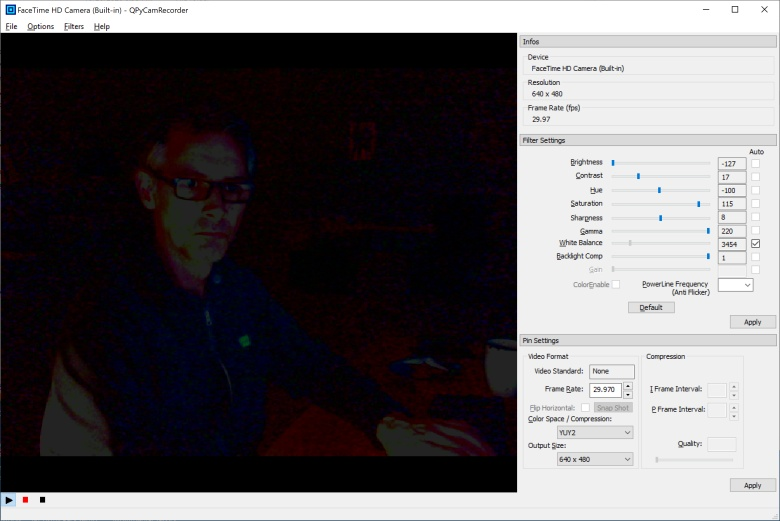

# QPyCamRecorder
A simple Camera Viewer and Recorder for Windows based on Python 3, PyQt5 and DirectShow.

[QPyCamRecorder](https://github.com/59de44955ebd/QPyCamRecorder) is a portable GUI application for Windows (64-bit) that allows to view/play video input devices/cameras and to record to AVI (MJPEG) or MP4 (H.264). Optionally also audio can be recorded (as uncompressed PCM format).

It comes with 2 virtual cameras integrated, [ScreenCam](https://github.com/59de44955ebd/ScreenCam) and [SpoutCam](https://github.com/leadedge/SpoutCam). Those are loaded directly from the enclosed filter DLLs, so no filter registration needed.

**Screenshots**

* Apple FaceTime HD camera in QPyCamRecorder (Win 10/Boot Camp):

  

* [ScreenCam](https://github.com/59de44955ebd/ScreenCam) integrated into QPyCamRecorder (Win 8.1):

  

* [SpoutCam](https://github.com/leadedge/SpoutCam) integrated into QPyCamRecorder (Win 8.1):

  
